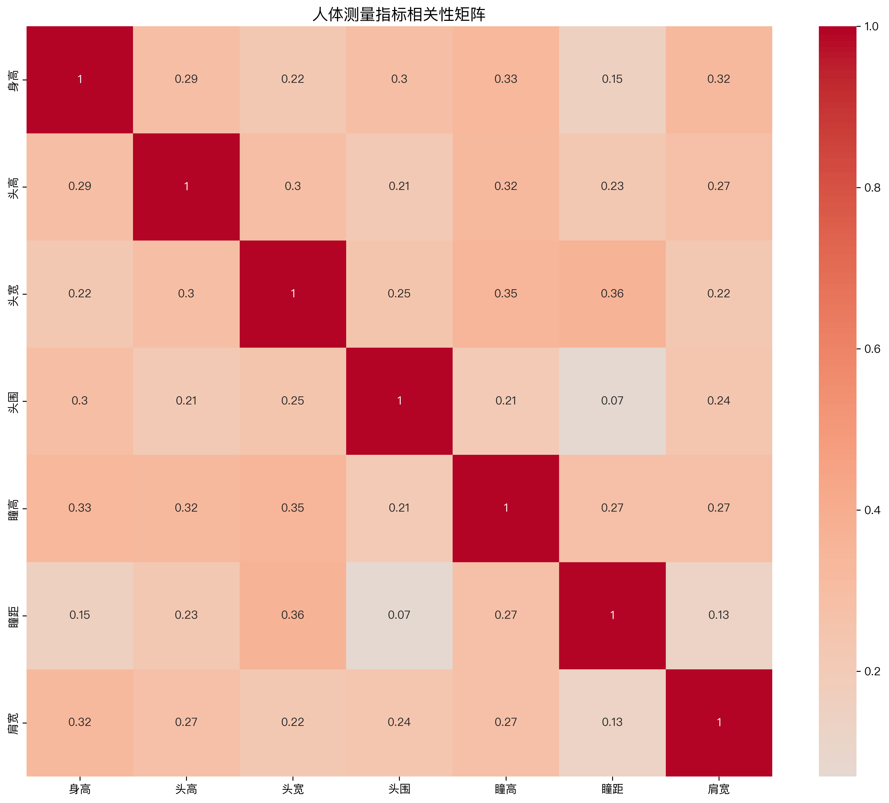
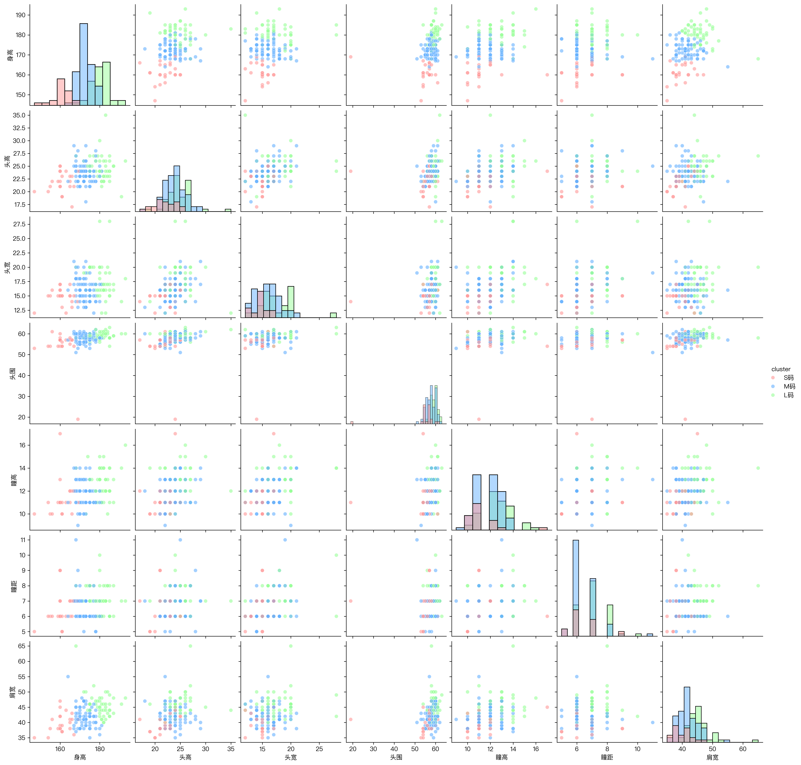
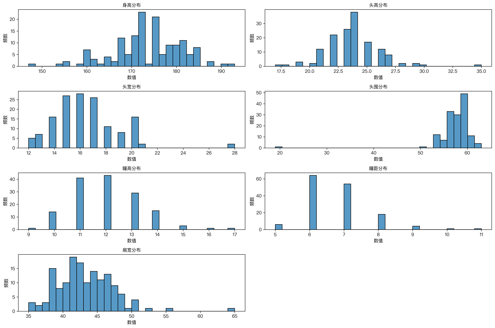
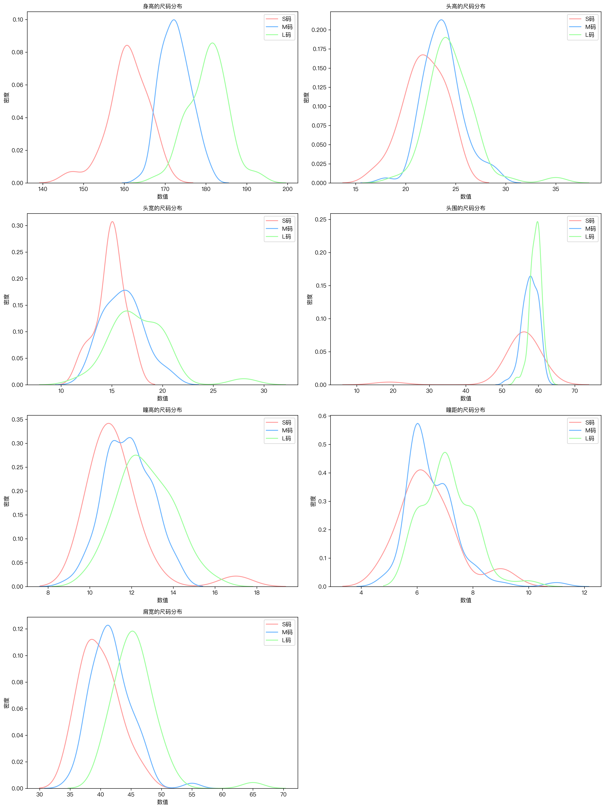

# 人体测量数据分析报告

## 1. 数据概览

本次分析基于对人体测量的7个关键指标的统计分析，包括身高、头部维度（头高、头宽、头围）、眼部特征（瞳高、瞳距）以及肩宽。

## 2. 基本统计分析

### 2.1 核心统计指标

| 指标 | 均值±标准差 | 范围 | P5-P95区间 | P25-P75区间 | 中位数 |
|------|------------|------|------------|-------------|--------|
| 身高 | 173.47±7.74 | 147-193 | 160-185 | 169-179.25 | 173 |
| 头高 | 23.72±2.30 | 17-35 | 21-27 | 22-25 | 24 |
| 头宽 | 16.47±2.52 | 12-28 | 13-20 | 15-18 | 16 |
| 头围 | 57.77±3.90 | 19-63 | 54-61 | 57-60 | 58 |
| 瞳高 | 12.03±1.34 | 9-17 | 10-14 | 11-13 | 12 |
| 瞳距 | 6.71±0.96 | 5-11 | 6-8 | 6-7 | 7 |
| 肩宽 | 42.80±4.11 | 35-65 | 37.35-48.65 | 40-45 | 42 |

### 2.2 聚类分析结果

#### 聚类 S (样本数: 23, 占比: 15.5%)
- 身高: 160.9±4.9 (147.0-169.0)
- 头高: 21.9±2.1 (17.0-25.0)
- 头宽: 14.9±1.4 (12.0-17.0)
- 头围: 54.5±8.0 (19.0-61.0)
- 瞳高: 11.3±1.5 (10.0-17.0)
- 瞳距: 6.4±1.0 (5.0-9.0)
- 肩宽: 39.8±3.1 (35.0-47.0)

#### 聚类 M (样本数: 74, 占比: 50.0%)
- 身高: 172.6±3.6 (164.0-181.0)
- 头高: 23.7±2.0 (18.0-29.0)
- 头宽: 16.1±2.0 (12.0-21.0)
- 头围: 57.8±2.2 (51.0-62.0)
- 瞳高: 11.8±1.1 (9.0-14.0)
- 瞳距: 6.5±0.9 (5.0-11.0)
- 肩宽: 41.8±3.3 (35.0-55.0)

#### 聚类 L (样本数: 51, 占比: 34.5%)
- 身高: 180.5±4.8 (168.0-193.0)
- 头高: 24.6±2.4 (19.0-35.0)
- 头宽: 17.7±3.0 (12.0-28.0)
- 头围: 59.3±1.6 (54.0-63.0)
- 瞳高: 12.7±1.3 (10.0-16.0)
- 瞳距: 7.1±0.9 (6.0-10.0)

### 2.3 相关性分析

主要发现：
1. 身高与其他指标的相关性：
   - 与肩宽最强（0.323）
   - 与瞳高（0.328）和头围（0.296）有中等相关性
   - 与瞳距相关性最弱（0.154）

2. 头部指标间的相关性：
   - 头高与头宽相关系数为0.297
   - 头围与其他头部指标相关性相对较弱

3. 眼部特征相关性：
   - 瞳高与头宽（0.348）显示最强相关性
   - 瞳距与头宽（0.362）相关性最显著

## 3. 可视化分析

### 3.1 相关性矩阵

### 3.2 散点图矩阵

### 3.3 尺寸分布

### 3.4 聚类分布

## 4. 项目文件

- `analyze_metrics.py`: 分析脚本
- `requirements.txt`: 项目依赖

## 功能特点

- 基础统计分析（均值、标准差、分位数等）
- 相关性分析
- K-means聚类分析
- 可视化分析（散点图、相关性矩阵等）
- 尺码自动划分

## 文件结构

- `analyze_metrics.py`: 主要分析脚本
- `analysis_report.md`: 分析报告
- `body_metrics.csv`: 原始数据
- 输出文件：
  - `metrics_statistics.csv`: 统计分析结果
  - `correlation_matrix.csv`: 相关性分析结果
  - `size_ranges.csv`: 尺码划分结果
  - `cluster_analysis.csv`: 聚类分析结果
  - 可视化图表：
    - `correlation_matrix.png`
    - `scatter_matrix.png`
    - `size_distributions.png`
    - `cluster_distributions.png`

## 使用方法

1. 安装依赖： 