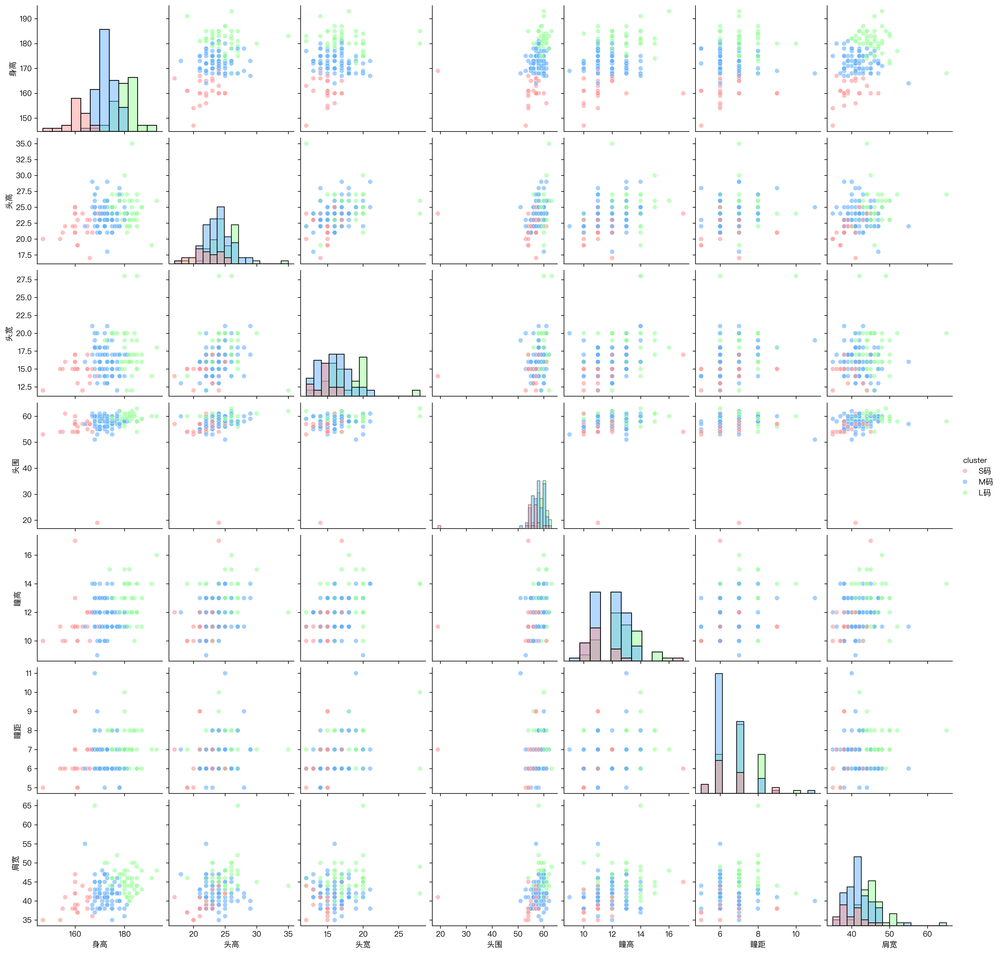

# 人体测量数据分析报告

## 1. 数据概览

本次分析基于对人体测量的7个关键指标的统计分析，包括身高、头部维度（头高、头宽、头围）、眼部特征（瞳高、瞳距）以及肩宽。

## 2. 基本统计分析

### 2.1 核心统计指标

| 指标 | 均值±标准差 | 范围 | P5-P95区间 | P25-P75区间 | 中位数 |
|------|------------|------|------------|-------------|--------|
| 身高 | 173.47±7.74 | 147-193 | 160-185 | 169-179.25 | 173 |
| 头高 | 23.72±2.30 | 17-35 | 21-27 | 22-25 | 24 |
| 头宽 | 16.47±2.52 | 12-28 | 13-20 | 15-18 | 16 |
| 头围 | 57.77±3.90 | 19-63 | 54-61 | 57-60 | 58 |
| 瞳高 | 12.03±1.34 | 9-17 | 10-14 | 11-13 | 12 |
| 瞳距 | 6.71±0.96 | 5-11 | 6-8 | 6-7 | 7 |
| 肩宽 | 42.80±4.11 | 35-65 | 37.35-48.65 | 40-45 | 42 |

### 2.2 指标相关性分析

主要相关性发现：
1. 身高与其他指标的相关性：
   - 与肩宽最强（0.323）
   - 与瞳高（0.328）和头围（0.296）有中等相关性
   - 与瞳距相关性最弱（0.154）

2. 头部指标间的相关性：
   - 头高与头宽相关系数为0.297
   - 头围与其他头部指标相关性相对较弱

3. 眼部特征相关性：
   - 瞳高与头宽（0.348）显示最强相关性
   - 瞳距与头宽（0.362）相关性最显著

## 3. 尺码划分方案

### 3.1 身高尺码
| 尺码 | 范围 | 平均值 |
|------|------|--------|
| S | 147.0-171.0 | 165.0 |
| M | 171.0-177.0 | 173.6 |
| L | 177.0-193.0 | 181.3 |

### 3.2 肩宽尺码
| 尺码 | 范围 | 平均值 |
|------|------|--------|
| S | 35.0-41.0 | 38.3 |
| M | 41.0-44.0 | 41.8 |
| L | 44.0-65.0 | 46.3 |

### 3.3 头部测量尺码
| 指标 | 尺码 | 范围 | 平均值 |
|------|------|------|--------|
| 头高 | S | 17.0-23.0 | 21.2 |
|      | M | 23.0-24.0 | 23.0 |
|      | L | 24.0-35.0 | 25.1 |
| 头宽 | S | 12.0-15.0 | 13.4 |
|      | M | 15.0-17.0 | 15.5 |
|      | L | 17.0-28.0 | 18.3 |
| 头围 | S | 19.0-57.0 | 53.8 |
|      | M | 57.0-59.0 | 57.6 |
|      | L | 59.0-63.0 | 60.0 |

### 3.4 眼部测量尺码
| 指标 | 尺码 | 范围 | 平均值 |
|------|------|------|--------|
| 瞳高 | S | 9.0-11.0 | 9.9 |
|      | M | 11.0-12.0 | 11.5 |
|      | L | 12.0-17.0 | 13.5 |
| 瞳距 | S | 5.0-6.0 | 5.0 |
|      | M | 6.0-7.0 | 6.0 |
|      | L | 7.0-11.0 | 7.4 |

## 4. 建议

基于数据分析结果，我们建议：

1. **主要参考指标**：
   - 以身高作为主要分类依据（标准差±7.74）
   - 将肩宽作为次要参考指标（标准差±4.11）

2. **尺码设计要点**：
   - 身高尺码区间：S(≤171cm), M(171-177cm), L(≥177cm)
   - 肩宽尺码区间：S(≤41cm), M(41-44cm), L(≥44cm)
   - 头围采用较宽松的区间设计，考虑到其分布特征

3. **特殊考虑**：
   - 瞳高和瞳距的变化范围较小，可以采用固定尺寸或简化分级
   - 头部相关指标可采用弹性或可调节设计，增加适配性

## 5. 散点图矩阵分析



散点图矩阵展示了各指标之间的关系：
1. 可以观察到身高与肩宽的线性关系
2. 其他指标之间的关系较为分散
3. 部分指标呈现聚类特征

## 6. 数据文件

详细数据可在以下文件中查看：
- metrics_statistics.csv：基础统计数据
- correlation_matrix.csv：相关性矩阵数据
- size_ranges.csv：详细尺码区间数据 

## 7. 输出
```
~/mycode/kigland-research-size via 🐍 v3.13.0 (venv) 
❯ python analyze_metrics.py 

基本统计量:
       mean±std          range         p5-p95        p25-p75  median
身高  173.47±7.74  147.00-193.00  160.00-185.00  169.00-179.25  173.00
头高   23.72±2.30    17.00-35.00    21.00-27.00    22.00-25.00   24.00
头宽   16.47±2.52    12.00-28.00    13.00-20.00    15.00-18.00   16.00
头围   57.77±3.90    19.00-63.00    54.00-61.00    57.00-60.00   58.00
瞳高   12.03±1.34     9.00-17.00    10.00-14.00    11.00-13.00   12.00
瞳距    6.71±0.96     5.00-11.00      6.00-8.00      6.00-7.00    7.00
肩宽   42.80±4.11    35.00-65.00    37.35-48.65    40.00-45.00   42.00

相关性系数矩阵:
       身高     头高     头宽     头围     瞳高     瞳距     肩宽
身高  1.000  0.292  0.219  0.296  0.328  0.154  0.323
头高  0.292  1.000  0.297  0.212  0.322  0.225  0.273
头宽  0.219  0.297  1.000  0.245  0.348  0.362  0.222
头围  0.296  0.212  0.245  1.000  0.210  0.070  0.237
瞳高  0.328  0.322  0.348  0.210  1.000  0.274  0.273
瞳距  0.154  0.225  0.362  0.070  0.274  1.000  0.132
肩宽  0.323  0.273  0.222  0.237  0.273  0.132  1.000

执行K-means聚类分析...
轮廓系数: 0.194

聚类分析结果:

聚类 0 (样本数: 23, 占比: 15.5%)
------------------------------------------------------------
        身高: 160.9±4.9 (147.0-169.0)
        头高: 21.9±2.1 (17.0-25.0)
        头宽: 14.9±1.4 (12.0-17.0)
        头围: 54.5±8.0 (19.0-61.0)
        瞳高: 11.3±1.5 (10.0-17.0)
        瞳距: 6.4±1.0 (5.0-9.0)
        肩宽: 39.8±3.1 (35.0-47.0)

聚类 1 (样本数: 74, 占比: 50.0%)
------------------------------------------------------------
        身高: 172.6±3.6 (164.0-181.0)
        头高: 23.7±2.0 (18.0-29.0)
        头宽: 16.1±2.0 (12.0-21.0)
        头围: 57.8±2.2 (51.0-62.0)
        瞳高: 11.8±1.1 (9.0-14.0)
        瞳距: 6.5±0.9 (5.0-11.0)
        肩宽: 41.8±3.3 (35.0-55.0)

聚类 2 (样本数: 51, 占比: 34.5%)
------------------------------------------------------------
        身高: 180.5±4.8 (168.0-193.0)
        头高: 24.6±2.4 (19.0-35.0)
        头宽: 17.7±3.0 (12.0-28.0)
        头围: 59.3±1.6 (54.0-63.0)
        瞳高: 12.7±1.3 (10.0-16.0)
        瞳距: 7.1±0.9 (6.0-10.0)
```
